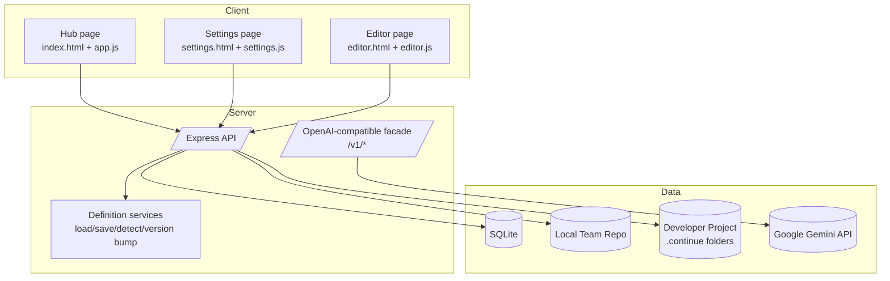
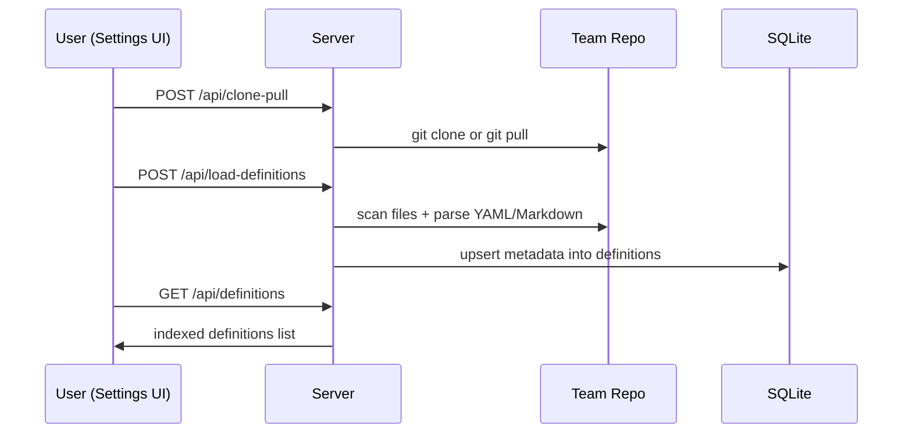
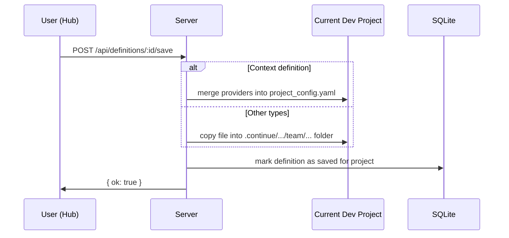
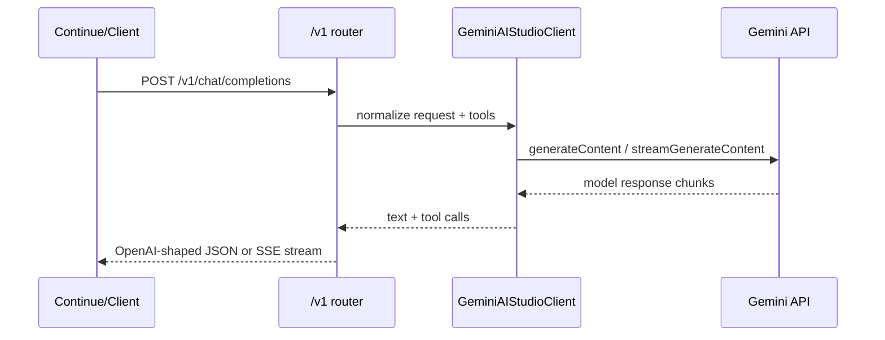

# System Architecture

## 1) High-Level Architecture
DCC is a local-first server/client system with three main zones:
1. **Client UI** (Hub, Settings, Editor) in the browser.
2. **Application Server** (Express) coordinating API requests.
3. **Persistence + External Integration**:
   - Local SQLite database,
   - local filesystem (repo and `.continue` project folders),
   - optional Google Gemini upstream through an OpenAI-compatible facade.

---

## 2) Core Entities and Connectivity

## 2.1 Persistent entities (SQLite)

### `settings`
Key-value configuration store (examples: `repoUrl`, `repoPath`, `currentDevProject`).

### `definitions`
Indexed catalog of discovered definition files with metadata:
- `key`, `name`, `description`, `tags`, `schema`, `version`,
- `content`, `type`, `filePath`, `source`, `status`, `updatedAt`, `inTeam`.

### `dev_project_roots`
Configured root directories used for recursive scanning of local git projects.

### `dev_projects`
Materialized list of discovered dev projects (directory contains `.git`).

### `project_definition_copies`
Join-like registry: which definition key has been copied into which dev project.

---

## 2.2 Domain entities

### Definition
A unit document representing one reusable AI/config artifact. Common types:
- model,
- prompt,
- rule,
- agent,
- workflow,
- context,
- mcpServer.

### Repository workspace
Team source repository where definitions can be cloned, pulled, published, duplicated, updated, and pushed upstream.

### Developer project workspace
A selected local project where definitions are copied into `.continue/.../team/...` directories.

### AI session facade
OpenAI-compatible requests are translated to Gemini API calls by the server.

---

## 3) Main Runtime Flows

## 3.1 Definition ingestion flow

## 3.2 Save-to-dev-project flow

## 3.3 OpenAI-compatible inference flow

---

## 4) Interface Surfaces

## 4.1 Hub UI
- Browse/search/filter definition catalog.
- View details, source content, metadata, and status.
- Actions: save to project, remove from project, duplicate, edit, push upstream, delete.

## 4.2 Settings UI
- Configure repository URL/path.
- Trigger clone/pull and load-definitions.
- Manage dev-project roots and auto-discovered project list.
- Toggle theme.

## 4.3 Editor UI
- Create/edit definitions by type with structured forms.
- Keep synchronized with raw YAML/Markdown source.
- Server-side type detection and persistence endpoints.

---

## 5) Architectural Strengths
- **Local-first**: data is stored locally (SQLite + filesystem).
- **Composable docs model**: YAML and Markdown definitions are easy to version-control.
- **Provider abstraction**: OpenAI-compatible facade enables tool interoperability while using Gemini.
- **Multi-project workflow**: one definition hub can supply many local developer projects.

