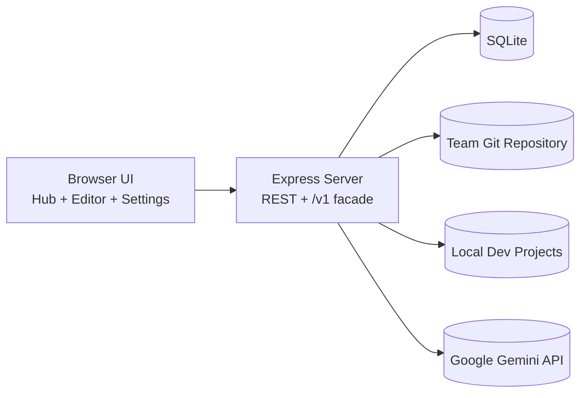
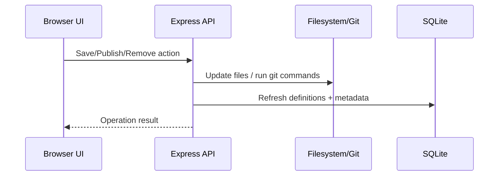

# DCC System Architecture

## Overview

DCC (Developer Control Center) is a local-first monolith composed of:
1. A static browser client (`src/client`),
2. A Node.js + Express API server (`src/server`),
3. A SQLite data store (`data/dcc.sqlite` by default),
4. Local filesystem + git integration for definition files and dev projects,
5. Optional Gemini-backed inference behind an OpenAI-compatible API facade.

## Runtime topology

## Server composition

`src/server/server.js` wires middleware and route modules.

- `routes/settings.js` — repository and active dev project settings.
- `routes/projects.js` — dev root management + project scanning metadata.
- `routes/repo.js` — clone/pull and load-definition sync.
- `routes/definitions.js` — catalog, tags, references, and suggestions APIs.
- `routes/lifecycle.js` — duplicate/save/remove/publish/delete/push-upstream operations.
- `routes/validation.js` — validation execution and history retrieval.
- `routes/versions.js` — git version history listing/fetch/restore.
- `routes/editor.js` — editor load/detect/save endpoints.
- `routes/openai.js` — OpenAI-compatible `/v1/*` endpoints using Gemini.

## Persistence model

The database is created/migrated in `src/server/db/index.js`.

Primary tables:
- `settings`
- `definitions`
- `definition_versions`
- `dev_project_roots`
- `dev_projects`
- `project_definition_copies`
- `validation_results`

The `definitions` table is the central catalog; associated tables store:
- historical versions,
- where definitions were copied in local projects,
- validation run outputs,
- project scan metadata used for recommendation ranking.

## Definition lifecycle flow

Lifecycle routes refresh indexed definitions after write operations so UI state is consistent with on-disk truth.

## Project recommendation flow

1. User selects a current dev project (`/api/current-dev-project`).
2. Scanner stores project type/signals in `dev_projects`.
3. `/api/definitions/suggestions` uses project type + path hints + definition tags/keywords.
4. Response returns deterministic ranking + explainable reasons.

## AI facade flow

`/v1/*` endpoints validate request payloads with Zod, call Gemini client adapters, and return OpenAI-shaped payloads (including SSE chunks for streaming endpoints).

## Error handling strategy

- Route-level `try/catch` returns JSON `{ error }` envelopes.
- Git operations classify common failure categories.
- Validation/history routes return explicit not-found semantics for missing definitions.
- Editor save rejects duplicate DCC URIs to preserve catalog uniqueness.
