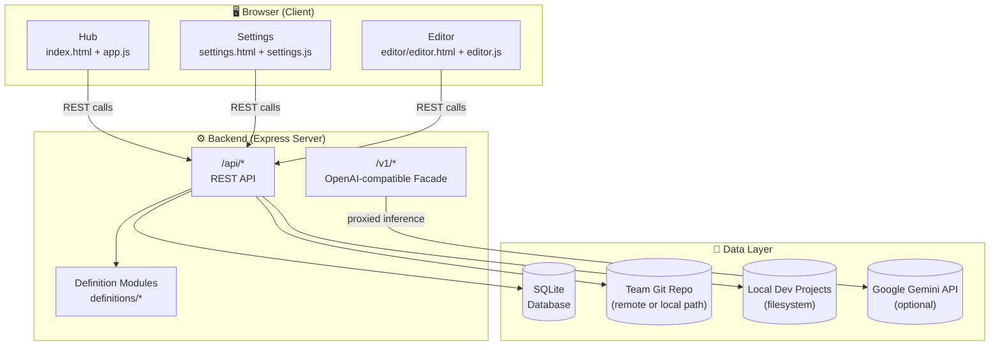
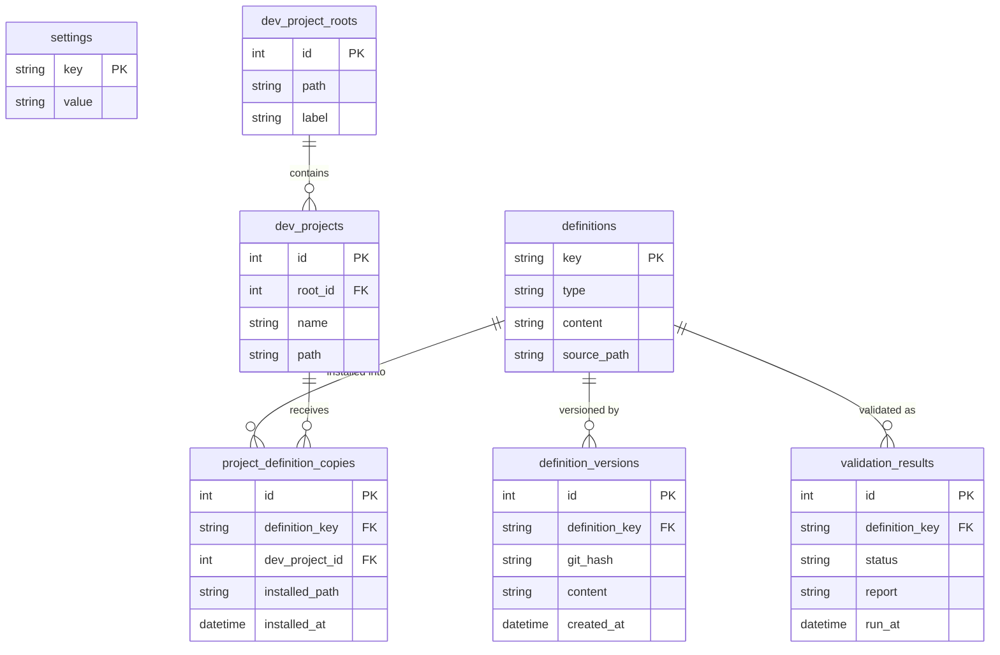
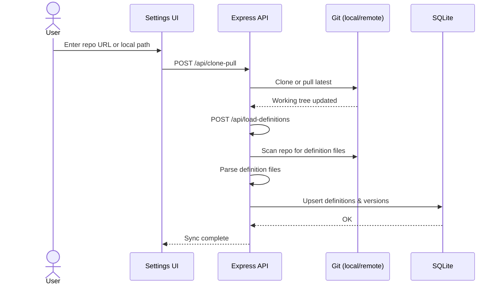
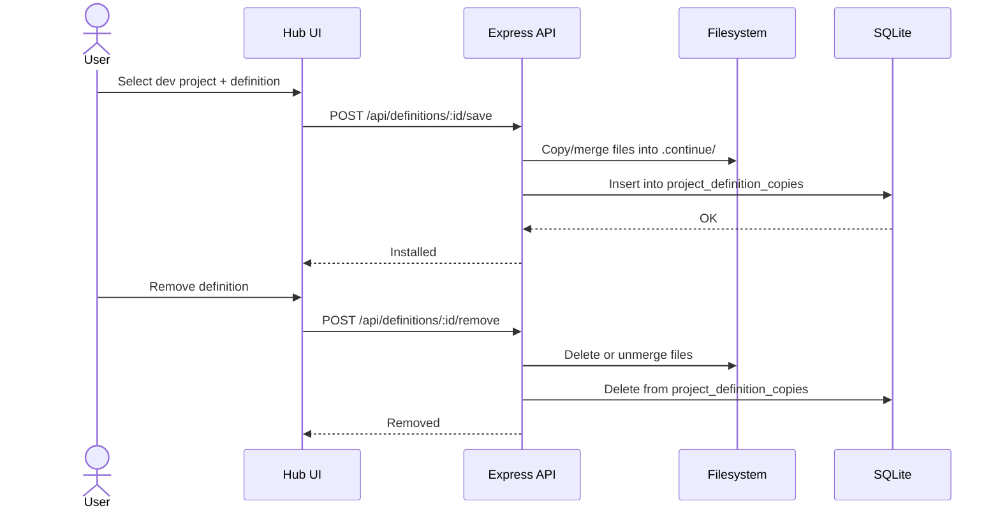
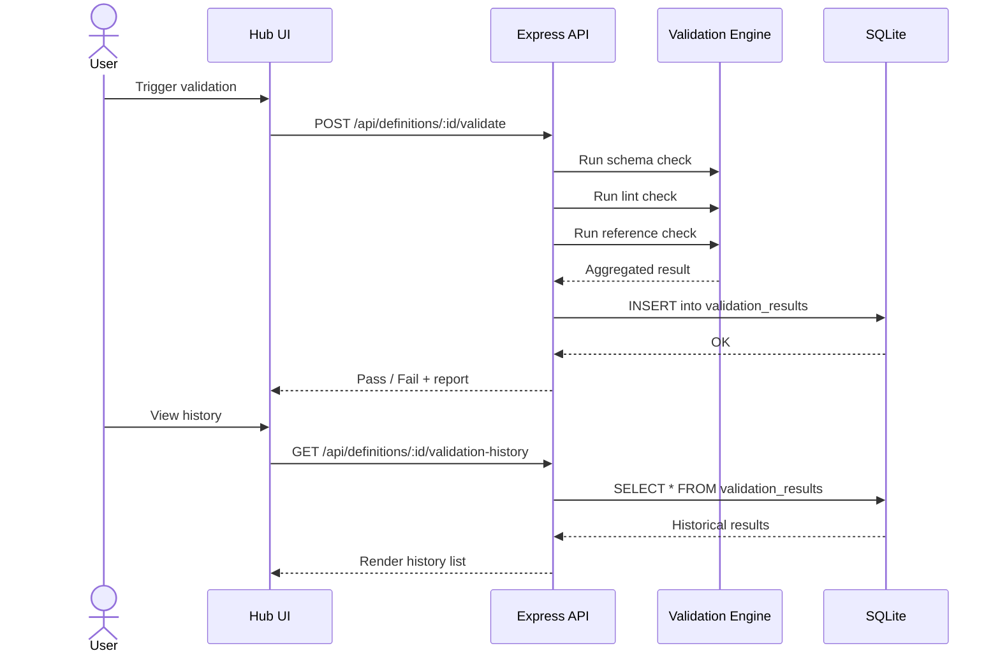
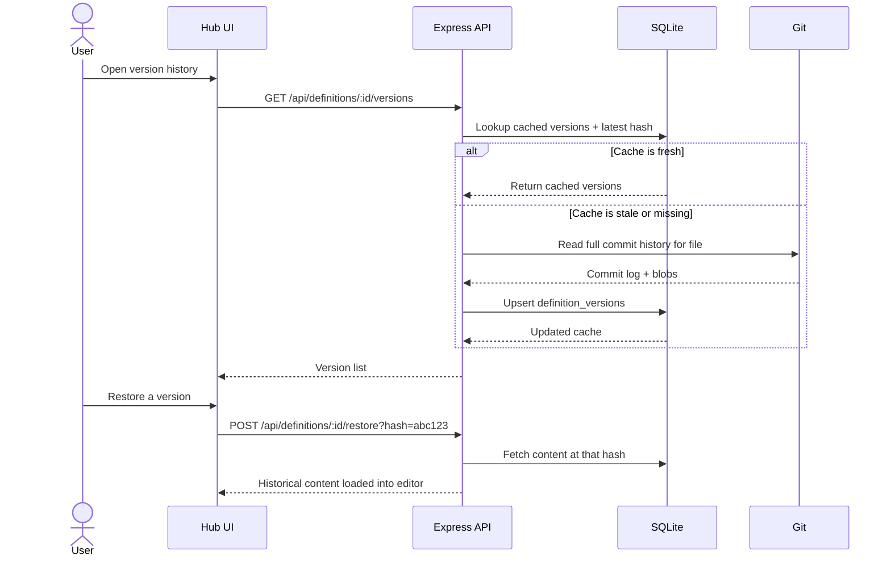
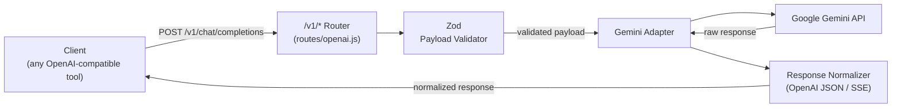

# DCC System Architecture

## Overview

DCC (Definition Catalog & Coordinator) is a **local-first web application** that manages software definitions — structured configuration or code artifacts — across a team catalog and multiple local development projects. It provides a browser-based UI, a local Express backend, and optional AI-assisted inference, all running on the developer's own machine with no cloud dependency beyond an optional Gemini API integration.

The system is composed of three conceptual layers:

- **Browser UI** — Hub, Settings, and Editor interfaces
- **Backend Server** — REST API, validation engine, and an OpenAI-compatible inference facade
- **Local Data Layer** — SQLite database, local filesystem, a team git repository, and the Google Gemini API

---

## 1. High-Level Topology

The Hub is the primary workspace for browsing, installing, and validating definitions. The Settings page configures the git repo source and project roots. The Editor provides a structured form-based interface for authoring or modifying definitions. All three communicate exclusively through the backend REST API.

---

## 2. Data Model & Persistence

The server initializes a SQLite database with **7 core tables** on startup. The schema is designed around definitions as the central entity, with supporting tables for versioning, project placement, and validation history.

**Key relationships:**

- `definitions.key` is the canonical identifier used throughout the system.
- `definition_versions` caches git history per definition, keyed to a git commit hash.
- `project_definition_copies` is the mapping table that tracks exactly which definitions are installed into which local project.
- `validation_results` stores each validation run's outcome, enabling both latest-result lookups and historical auditing.

---

## 3. Core Runtime Flows

### 3.1 Repository Sync & Indexing

Definitions are sourced from a shared team git repository. Syncing brings the local cache up to date.

### 3.2 Definition Install & Remove

Users can materialize a catalog definition into any active local development project. The install process copies or merges definition files into the project's `.continue` directory structure, and the database mapping table is updated accordingly.

### 3.3 Validation

Definitions can be validated against schema, lint rules, and cross-reference checks. Results are persisted so users can view the latest run or browse historical outcomes.

### 3.4 Version History

Definition versions are lazily hydrated from git history and cached in SQLite. The cache is invalidated when the current git commit hash for a file has changed since the last cache write.

### 3.5 OpenAI-Compatible Inference

The `/v1/*` routes expose an OpenAI-compatible API surface backed by Google Gemini. This allows tools or extensions that expect an OpenAI endpoint to work transparently with local Gemini-powered inference.

---

## 4. API Surface

### Product API — `/api/*`

Served by `server.js`. Covers all core application functionality.

| Area | Endpoints |
|---|---|
| **Settings** | Read/write app configuration |
| **Repository** | Clone, pull, load definitions from git repo |
| **Projects** | Manage dev project roots and discovered projects |
| **Definitions** | List, read, save, remove, and validate definitions |
| **Validation** | Trigger validation runs; read latest and historical results |
| **Versions** | List versions, fetch content at a given hash, restore |
| **Editor** | Helper endpoints for structured definition authoring |

### Inference API — `/v1/*`

Served by `routes/openai.js`. Provides an OpenAI-compatible interface backed by Gemini.

| Route | Purpose |
|---|---|
| `POST /v1/chat/completions` | Chat completions (streaming and non-streaming) |
| Other `/v1/*` routes | Additional OpenAI-compatible endpoints as implemented |

---

## 5. Architectural Characteristics

### Local-First
All state — the SQLite database, synced definition files, and installed project copies — lives on the local machine. The only network calls are to the team git remote (for sync) and optionally to the Gemini API (for inference). No user data is sent to a cloud service.

### Git-Native
Git is the authoritative source for the definition catalog. Sync, version history extraction, and any publish or push workflows are all implemented directly as git operations, ensuring that definitions are always traceable and recoverable.

### Type-Aware Definition Platform
The validation engine, editor form generation, and file merge logic are all definition-type aware. Each definition type can have its own schema, lint rules, and install behavior, making the platform extensible to new definition kinds without changing the core runtime.

### Project-Aware Deployment
A single catalog definition can be installed into multiple local development projects simultaneously. The `project_definition_copies` table tracks the installed state of every definition in every project, enabling the Hub to surface per-project installation status at a glance.
