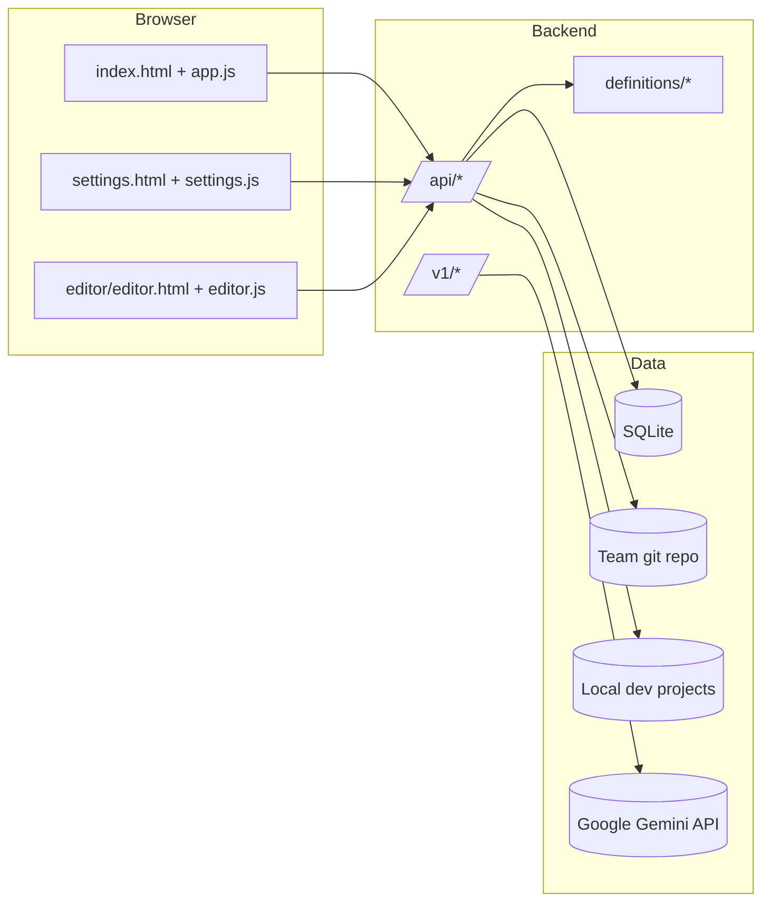

# System Architecture

## 1) High-Level Topology
DCC is a local-first web app with three layers:
1. Browser client (Hub, Settings, Editor).
2. Express server (REST API + OpenAI-compatible facade).
3. Local persistence/integration (SQLite + filesystem + git + optional Gemini API).

## 2) Persistence Model
`src/server/server.js` initializes 7 core tables:
- `settings`
- `definitions`
- `definition_versions`
- `dev_project_roots`
- `dev_projects`
- `project_definition_copies`
- `validation_results`

### Key relationships
- `definitions.key` is the central definition identifier.
- `definition_versions.definition_key` references current catalog entries.
- `project_definition_copies` tracks where definitions are installed.
- `validation_results` stores per-definition validation runs and reports.

## 3) Main Runtime Flows

### 3.1 Repository sync and indexing
1. Settings page saves repo URL/path.
2. `POST /api/clone-pull` runs clone-or-pull.
3. `POST /api/load-definitions` scans, parses, and upserts definitions.

### 3.2 Definition install/remove into current project
1. User selects active dev project.
2. `POST /api/definitions/:id/save` copies or merges into `.continue` structure.
3. `POST /api/definitions/:id/remove` reverses file copy/merge.
4. DB mapping table reflects saved state.

### 3.3 Validation flow
1. Hub requests `POST /api/definitions/:id/validate`.
2. Server runs schema/lint/reference checks.
3. Result is stored in `validation_results`.
4. UI can load latest or history via dedicated endpoints.

### 3.4 Version history flow
1. User requests versions for a definition.
2. Server compares cached `definition_versions` to git latest hash.
3. If stale/missing, git history is re-hydrated and cached.
4. User can fetch historical content or restore a selected version.

### 3.5 OpenAI-compatible inference flow
1. Client sends request to `/v1/*`.
2. Router validates payload with Zod.
3. Gemini adapter executes request.
4. Response is normalized to OpenAI-compatible JSON/SSE.

## 4) API Surface Areas
- Main product API in `server.js` under `/api/*` (settings, projects, definitions, validation, versions, editor helpers).
- LLM compatibility API in `routes/openai.js` under `/v1/*`.

## 5) Architectural Characteristics
- **Local-first**: state and files remain on the local machine.
- **Git-native**: sync, history extraction, publish, and push workflows all rely on git commands.
- **Type-aware definition platform**: parsing, validation, and editor forms are definition-type specific.
- **Project-aware deployment**: catalog items can be materialized into many local projects with tracked state.
