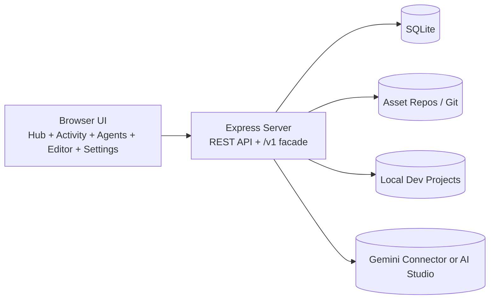
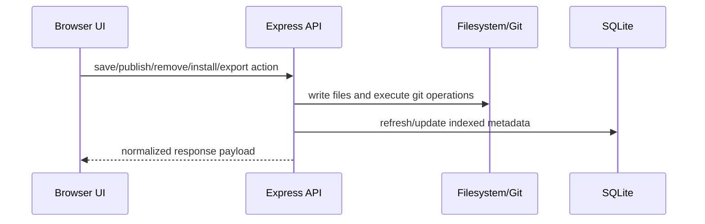

# DCC System Architecture

## Overview

DCC (Developer Control Center) is a **local-first monolith** composed of:

1. A static browser client served from `src/client`.
2. A Node.js + Express API server in `src/server`.
3. A SQLite datastore (`data/dcc.sqlite` by default).
4. Local filesystem + git integration for definition lifecycle operations.
5. Optional Gemini-backed inference exposed via an OpenAI-compatible `/v1` API.

The app is designed to work offline/local for core workflows (cataloging, editing, installing, validating, versioning), with AI features activated only when configured.

## Runtime topology

## Frontend composition

- **Hub UI (`src/client/ui/appController.js`)** orchestrates definition browsing, filtering, install/export actions, recommendations, validation, and version-diff interactions.
- **Activity UI** presents live and historical agent run status/logs and controls (stream, cancel, rerun).
- **Agents workflow UI** prepares run packs and launch parameters for agent execution.
- **Editor UI (`src/client/editor/*`)** handles type detection, form/source editing, schema-aware save, and helper actions.
- **Settings UI (`src/client/settings/*`)** manages repository configuration, dev project roots, AI provider settings, backups, and import/export.

All pages call server endpoints through modular API wrappers and update page-scoped/stateful controllers.

## Server composition

`src/server/server.js` bootstraps DB initialization, static hosting, middleware, and route modules.

### Route modules

- `routes/openai.js` — OpenAI-compatible `/v1/models`, `/v1/completions`, and `/v1/chat/completions` backed by Gemini clients.
- `routes/definitions.js` — definition catalog listing, references, tags, and project-context suggestions.
- `routes/lifecycle.js` — duplicate/save/publish/remove/delete/push/tag lifecycle actions.
- `routes/editor.js` — load definition content, detect type, and save editor payloads.
- `routes/validation.js` — validate definitions and persist validation history.
- `routes/versions.js` — git-backed version history listing/fetch/restore.
- `routes/projects.js` — dev project root management and project scanning APIs.
- `routes/settings.js` — app settings, onboarding state, current dev project, asset repo CRUD, and DB backup/restore.
- `routes/repo.js` — app update metadata and asset-repo sync/load operations.
- `routes/agentRunPacks.js` — persisted run-pack templates per `(agentId, configId)`.
- `routes/agentRuns.js` — launch/list/inspect/stream/kill agent runs.

## Core backend domains

- **Definitions domain (`src/server/definitions/*`)**
  - parsing and metadata extraction,
  - type detection and content normalization,
  - installation logic for Continue/Copilot/Gemini destinations,
  - export compatibility + request validation,
  - recommendation scoring,
  - validation helpers.

- **Project scan domain (`src/server/projects/scan/*`)**
  - filesystem signal collection,
  - language/platform detection,
  - technology inference and heuristic scoring.

- **Agent run domain (`src/server/services/agentRunManager/*`)**
  - process launch and lifecycle tracking,
  - stdout/stderr persistence,
  - stream subscriptions,
  - cancellation/cleanup.

- **AI domain (`src/server/services/ai/*`)**
  - Gemini Connector client,
  - Gemini AI Studio client,
  - request/response adaptation to OpenAI-shaped payloads.

## Persistence model

SQLite schema is initialized/migrated in `src/server/db/index.js`.

### Main tables

- `settings`
- `asset_repos`
- `definitions`
- `definition_versions`
- `dev_project_roots`
- `dev_projects`
- `project_definition_copies`
- `project_definition_destinations`
- `validation_results`
- `agent_run_packs`
- `agent_runs`
- `agent_run_logs`

The `definitions` table remains the central catalog, while supporting tables track:
- version snapshots and commit metadata,
- install destinations per project,
- validation reports over time,
- project scan metadata for recommendation ranking,
- agent run execution and logs.

## Key flows

### Definition lifecycle flow

### Recommendation flow

1. User selects current dev project.
2. Scanner persists project signals/type/technologies.
3. Suggestions endpoint scores definitions against project context + tags/keywords.
4. UI receives ranked results and explanation metadata.

### Agent run flow

1. User chooses installed agent + config in a project.
2. API validates payload and resolves file paths.
3. AgentRunManager launches process and writes status/log rows.
4. UI polls or subscribes to stream endpoint for live updates/log output.
5. Optional kill endpoint requests cancellation.

### AI facade flow

1. `/v1/*` endpoint validates payloads with Zod.
2. Runtime selects Gemini Connector or AI Studio based on settings.
3. Response is normalized to OpenAI-compatible JSON/SSE.
4. Optional request/response logging is applied via AI logging configuration.

## Operational characteristics

- **Single-process deployment:** one Node server hosts both static client and API.
- **Local-first source of truth:** filesystem/git + SQLite, no required external DB/service.
- **Progressive AI integration:** app remains usable without Gemini configuration.
- **Deterministic recommendation + validation:** explainable scoring and persisted reports.
- **Observability hooks:** configurable AI traffic logging and file logger settings loaded at startup.
