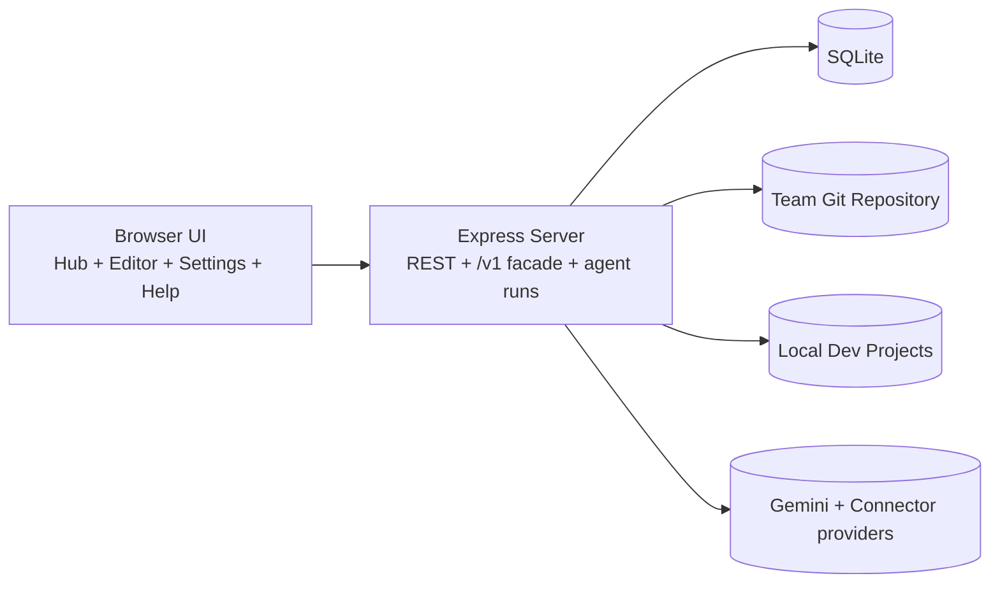
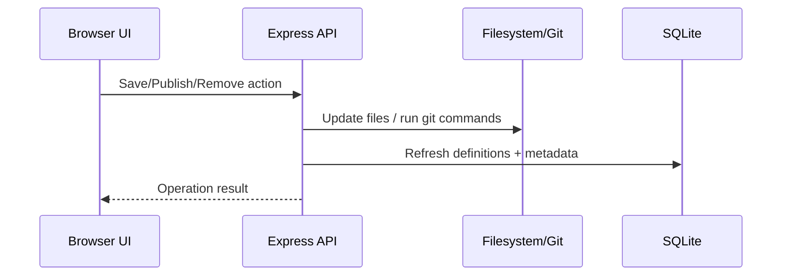

# DCC System Architecture

## Overview

DCC (Developer Control Center) is a local-first monolith composed of:
1. A static browser client (`src/client`) served by Express.
2. A Node.js + Express API server (`src/server`).
3. A SQLite data store (`data/dcc.sqlite` by default).
4. Local filesystem + git integration for definition files and dev projects.
5. Optional AI integrations for OpenAI-compatible chat endpoints and managed agent runs.

## Runtime topology

## Server composition

`src/server/server.js` wires middleware, static assets, and route modules.

- `routes/settings.js` — repository and active dev project settings.
- `routes/projects.js` — dev root management + project scanning metadata.
- `routes/repo.js` — clone/pull and load-definition sync.
- `routes/definitions.js` — catalog, tags, references, suggestions, and export APIs.
- `routes/lifecycle.js` — duplicate/save/remove/publish/delete/push-upstream operations.
- `routes/validation.js` — validation execution and history retrieval.
- `routes/versions.js` — git version history listing/fetch/restore.
- `routes/editor.js` — editor load/detect/save endpoints.
- `routes/openai.js` — OpenAI-compatible `/v1/*` endpoints backed by Gemini connectors.
- `routes/agentRuns.js` and `routes/agentRunPacks.js` — managed local agent runs and reusable run-pack flows.

## Domain and infrastructure layers

- `src/server/definitions/*` — type detection, parse/serialize, metadata extraction, install/save, validation, recommendations, and export services.
- `src/server/projects/scan/*` — project discovery, technology detection, AI signal enrichment, and repository signal extraction.
- `src/server/services/agentRunManager/*` — lifecycle management for local agent subprocesses.
- `src/server/services/ai/*` — Gemini connector and AI Studio clients.
- `src/server/versions/*` — git history helpers plus version cache.
- `src/server/db/*` — sqlite initialization and promise-based query helpers.
- `src/server/utils/*` — shared utilities (git/files/settings/env/logging/AI settings).

## Persistence model

The database is created/migrated in `src/server/db/index.js`.

Primary tables:
- `settings`
- `definitions`
- `definition_versions`
- `dev_project_roots`
- `dev_projects`
- `project_definition_copies`
- `validation_results`

The `definitions` table is the central catalog; associated tables store:
- historical versions,
- where definitions were copied in local projects,
- validation run outputs,
- project scan metadata used for recommendation ranking.

## Definition lifecycle flow

Lifecycle routes refresh indexed definitions after write operations so UI state is consistent with on-disk truth.

## Project recommendation flow

1. User selects a current dev project (`/api/current-dev-project`).
2. Scanner stores project type/signals in `dev_projects`.
3. `/api/definitions/suggestions` uses project type + path hints + definition tags/keywords.
4. Response returns deterministic ranking + explainable reasons.

## AI and agent-run flows

- `/v1/*` endpoints validate payloads, invoke Gemini clients, and return OpenAI-shaped responses (including SSE streaming).
- Agent run endpoints orchestrate local subprocess execution through `agentRunManager`, with normalized run options and tracked run state.

## Frontend composition

Primary client entry points:
- `src/client/app.js` — Hub bootstrap.
- `src/client/settings.js` — Settings and project-root management.
- `src/client/editor/editor.js` — Definition authoring/editor workbench.

Supporting frontend layers:
- `src/client/api/*` — API wrappers.
- `src/client/ui/appController/*` — hub orchestration.
- `src/client/editor/forms/*` and `src/client/editor/components/*` — type-specific UI + source sync.
- `src/client/state/*` and `src/client/services/*` — shared app state and reusable UI services.

## Error handling strategy

- Route-level `try/catch` returns JSON `{ error }` envelopes.
- Git operations classify common failure categories.
- Validation/history routes return explicit not-found semantics for missing definitions.
- Editor save rejects duplicate DCC URIs to preserve catalog uniqueness.
