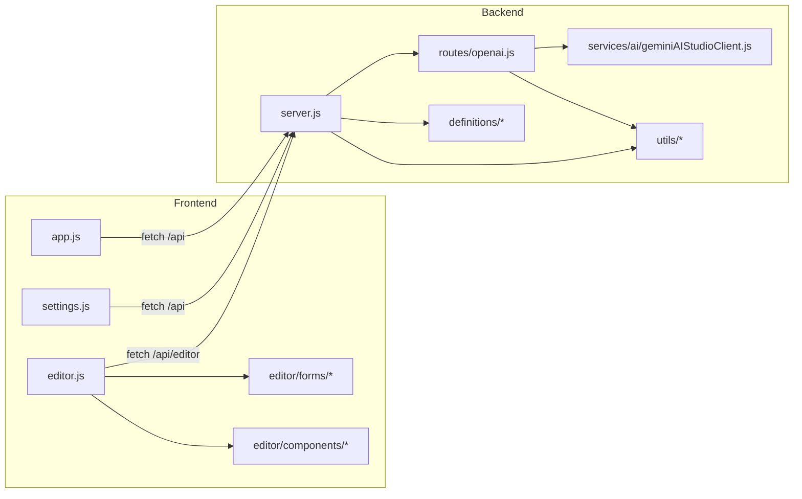

# Code Architecture

## 1) Repository Layout

```text
src/
  client/
    index.html
    app.js
    settings.html
    settings.js
    styles.css
    theme.js
    editor/
      editor.html
      editor.js
      editor.css
      components/
        arrayEditor.js
        yamlEditorSync.js
      forms/
        agentForm.js
        contextForm.js
        mcpServerForm.js
        modelForm.js
        promptForm.js
        ruleForm.js
        workflowForm.js
  server/
    server.js
    routes/
      openai.js
    definitions/
      detectDefinitionType.js
      loadDefinition.js
      saveDefinition.js
      versionBump.js
    services/ai/
      geminiAIStudioClient.js
    utils/
      env.js
      logger.js
```

---

## 2) Backend Code Architecture

## 2.1 Entry point: `src/server/server.js`
Main responsibilities:
- process configuration (port, DB path),
- SQLite initialization and schema creation,
- static web serving,
- primary REST API implementation,
- repository and filesystem operations,
- project scanning and definition indexing,
- definition save/remove/publish lifecycle.

### Internal helper groups in `server.js`
- **DB helpers**: `runDb`, `allDb`, `getDb`, `getSetting`, `setSetting`.
- **Git/shell helpers**: `runCommand`, error classification and extraction.
- **Definition parsing/indexing**: `parseDefinition`, `normalizeTags`, `loadDefinitions`.
- **Project synchronization**: `scanDevProjects`, `refreshDevProjects`.
- **Context-specific merge logic**: `parseContextProviders`, `upsertContextProviders`, `removeContextProviders`.

## 2.2 Route module: `src/server/routes/openai.js`
Responsibilities:
- exposes `/v1/models`, `/v1/completions`, `/v1/chat/completions`, `/v1/embeddings`,
- validates payloads with Zod,
- normalizes OpenAI-style inputs to Gemini calls,
- converts Gemini output into OpenAI-compatible response envelopes,
- supports both JSON and SSE streaming.

## 2.3 Definition submodules: `src/server/definitions/*`
- `detectDefinitionType.js`: YAML/Markdown heuristics for type detection.
- `loadDefinition.js`: safe path-resolved loading with traversal protection.
- `saveDefinition.js`: create/update definitions, version bumping, git workflows.
- `versionBump.js`: increments version values in YAML or frontmatter.

## 2.4 AI adapter: `src/server/services/ai/geminiAIStudioClient.js`
Encapsulates Gemini REST operations:
- list models,
- generate text,
- stream generation,
- embeddings.

## 2.5 Utility modules
- `env.js`: environment configuration (API keys/model defaults).
- `logger.js`: request-aware logging helpers.

---

## 3) Frontend Code Architecture

## 3.1 Hub page (`index.html` + `app.js`)
Feature clusters in `app.js`:
- definition loading and rendering cards,
- filter/search/tag interactions,
- detail drawer/panel handling,
- action handlers (save/remove/duplicate/push/edit/delete),
- dev-project selection,
- markdown preview rendering.

## 3.2 Settings page (`settings.html` + `settings.js`)
Contains forms and actions for:
- repo URL/path persistence,
- clone/pull execution,
- load-definitions trigger,
- dev root CRUD and scan result display,
- theme toggle state.

## 3.3 Editor page (`editor/editor.html` + `editor/editor.js`)
Layered design:
1. **Type handlers** (`handlers` map) decide parse/serialize/form strategy.
2. **Form controllers** (per type) hold structured state.
3. **Sync layer** (`createTextFormSync`) keeps raw text and form values coherent.
4. **Save/load adapter** talks to `/api/editor/*` endpoints.

## 3.4 Reusable editor components
- `arrayEditor.js`: generic dynamic list/nested-list form builder.
- `yamlEditorSync.js`: avoids drift between parsed objects and raw YAML/Markdown source.

---

## 4) Configuration Architecture

## 4.1 Runtime config sources
- Environment variables:
  - `PORT`
  - `DCC_DB_PATH`
  - Gemini credentials/model variables consumed by `env.js`
- Database settings keys:
  - `repoUrl`
  - `repoPath`
  - `currentDevProject`

## 4.2 Local data locations
- SQLite DB defaults to `data/dcc.sqlite`.
- Team definitions are loaded from configured repository path.
- Saved definitions are copied into selected project `.continue` tree.

---

## 5) Code Organization Metrics

| Area | Count |
|---|---:|
| Server route files | 1 dedicated + main server module |
| Definition service modules | 4 |
| AI provider modules | 1 |
| Editor form modules | 7 |
| Total JS source files | 22 |

---

## 6) Dependency Direction




---

## 7) Definition version history flow

The details-page Version History feature spans server, persistence, and UI:

1. **Server cache + git extraction (`src/server/server.js`)**
   - Boot-time schema creates `definition_versions` table and indexes.
   - `loadVersionHistoryFromGit` gathers commit timeline via `git log --follow` and file snapshots via `git show`.
   - `getVersionHistory` serves cached rows and refreshes when latest git hash diverges.

2. **History endpoints**
   - `GET /api/definitions/:id/versions` → dropdown list model
   - `GET /api/definitions/:id/versions/:version` → historical content/metadata payload
   - `POST /api/definitions/:id/versions/:version/restore` → restore selected content into current file

3. **Hub client (`src/client/index.html`, `src/client/app.js`, `src/client/styles.css`)**
   - Adds history button to action row and version badges in hero metadata.
   - Renders searchable dropdown, historical banner, and restore/back actions.
   - Swaps content/preview panels in-place when historical versions are selected.
