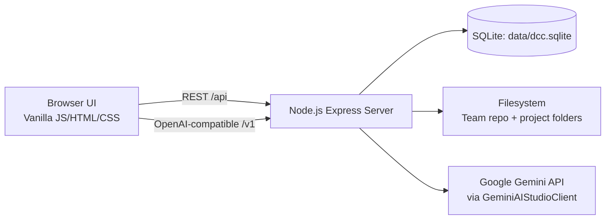

# Technology Stack

## 1) Overview
DCC (Developer Control Center) is a **Node.js + Express** local web application with:
- a browser-based client UI (vanilla JavaScript, HTML, CSS),
- an Express backend,
- a local SQLite database,
- YAML/Markdown definition parsing and editing,
- and an OpenAI-compatible API facade backed by Google Gemini.


---

## 2) Runtime and Package Ecosystem

## 2.1 Node.js runtime
- Project package manager metadata and runtime entrypoint are defined in `package.json`.
- The app starts with:

```bash
npm start
# -> node src/server/server.js
```

## 2.2 NPM dependencies
From `package.json`, the project depends on:

| Package | Role in this project |
|---|---|
| `express` | HTTP server, API routing, static file hosting |
| `dotenv` | Environment-variable loading |
| `sqlite3` | Local persistence for settings and indexed definitions |
| `gray-matter` | Markdown frontmatter parsing (agents/rules) |
| `yaml` | YAML parsing/serialization of definitions |
| `zod` | Request payload validation for OpenAI-compatible routes |

---

## 3) Backend Stack

## 3.1 Web framework
- **Express 4** powers server endpoints, JSON body parsing, and static asset serving.
- The server exposes two API surfaces:
  - Main REST API under `/api/*` for DCC features.
  - OpenAI-compatible API under `/v1/*` for model/tooling integrations.

## 3.2 Persistence
- **SQLite** is used as an embedded local database.
- DB location is configurable via `DCC_DB_PATH`; defaults to `data/dcc.sqlite`.
- Current schema includes **5 tables**:
  1. `settings`
  2. `definitions`
  3. `dev_project_roots`
  4. `dev_projects`
  5. `project_definition_copies`

## 3.3 AI integration layer
- `/v1` implements an OpenAI-compatible shape for:
  - model listing,
  - text completions,
  - chat completions,
  - embeddings.
- The concrete provider client is `GeminiAIStudioClient`, which calls Google AI Studio REST endpoints.

---

## 4) Frontend Stack

## 4.1 UI technology
- **Vanilla JavaScript modules** (no React/Vue/Svelte runtime).
- HTML pages:
  - `index.html` (hub)
  - `settings.html` (configuration and project roots)
  - `editor/editor.html` (definition editor)
- Styling via plain CSS in two files (`styles.css`, `editor/editor.css`).

## 4.2 Editor implementation style
- Type-specific forms are modularized per definition type:
  - `promptForm`, `mcpServerForm`, `modelForm`, `workflowForm`, `agentForm`, `ruleForm`, `contextForm`.
- Bidirectional sync between structured form state and raw YAML/Markdown text is handled by `yamlEditorSync.js`.

---

## 5) Data and File Formats

## 5.1 Formats used
- **YAML** for prompt/model/workflow/mcp/context definition documents.
- **Markdown + frontmatter** for agent/rule definitions.
- **JSON** for API payloads.
- **SSE (Server-Sent Events)** for streaming OpenAI-compatible responses.

## 5.2 Definition typing strategy
Definition type detection uses content heuristics:
- markdown frontmatter + lists -> `rule`,
- frontmatter with tools -> `agent`,
- YAML keys like `models`, `context`, `mcpServers`, `prompts` -> corresponding type categories.

---

## 6) Facts and Figures (current repo snapshot)

| Metric | Value |
|---|---:|
| JavaScript files | 22 |
| HTML files | 3 |
| CSS files | 2 |
| Editor form modules | 7 |
| `/api/*` endpoints in `server.js` | 20 |
| `/v1/*` OpenAI-compatible endpoints | 4 |
| SQLite tables created at boot | 5 |

> These figures were derived from repository file and route scans and reflect the current checked-in state.

---

## 7) Stack Diagram



