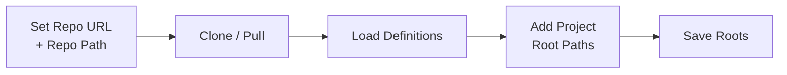

# DCC User Guide

DCC (Definition Catalog & Coordinator) is a local-first tool for managing, installing, and validating shared software definitions across your development projects. Definitions live in a team git repository; DCC syncs them to your machine, lets you install them into any local project, and tracks what's installed where.

This guide walks through setup, daily workflows, and the `/v1` inference API.

---

## 1. Prerequisites

| Requirement | Notes |
|---|---|
| Node.js + npm | Required to run the server |
| Git | Must be installed and authenticated against your team repo |
| Local dev projects | Filesystem paths to projects you want to manage definitions in |
| Gemini API key | Optional — only needed if you use the `/v1` inference endpoints |

---

## 2. Installation & Startup

```bash
npm install
npm start
```

The server starts at `http://localhost:3000`. The SQLite database and any synced repo files are stored locally — nothing leaves your machine except git sync traffic and optional Gemini API calls.

---

## 3. First-Time Setup

Open `http://localhost:3000/settings` and complete these steps in order. Each step depends on the previous one.



**Step-by-step:**

1. **Set Repo URL and Repo Path** — enter the remote URL of your team definition repository and the local path where it should be cloned.
2. **Clone/Pull** — triggers `POST /api/clone-pull`. DCC either clones the repo fresh or pulls the latest commits if it already exists locally.
3. **Load Definitions** — triggers `POST /api/load-definitions`. DCC scans the repo, parses each definition file, and upserts records into the local SQLite database.
4. **Add dev project root paths** — enter one or more parent directories that contain your local dev projects (e.g. `~/code`).
5. **Save Roots** — DCC walks those directories looking for git-initialized projects and registers them as available targets for definition installs.

> **Re-running setup:** You can re-run Clone/Pull and Load Definitions at any time to pick up changes from the team repo. Adding new project roots and saving them is similarly safe to repeat.

---

## 4. Key Concepts

Before diving into workflows, these three concepts are worth understanding:

**Definitions** are the central unit of the system. Each definition has a unique key, a type (which governs how it is parsed, validated, and installed), and content stored in the git repo. The `definitions.key` field is the canonical identifier used across every table in the database.

**The active dev project** is the project currently selected in the Hub. Save and Remove operations always target this project. Make sure the right project is selected before acting — there is no confirmation prompt.

**Installed copies** are tracked in the `project_definition_copies` table. A single definition can be installed in many projects simultaneously. The Hub surfaces per-project install status so you can see at a glance what is and isn't installed where.

---

## 5. Hub Workflows (`/`)

The Hub is the main workspace. It lists all indexed definitions and lets you filter, inspect, install, validate, and push them.

### 5.1 Finding Definitions

Use the filter controls to narrow the list:

- **Type filter** — show only definitions of a specific type (e.g. `context`, `prompt`, `rule`).
- **Text search** — matches against definition name and content.
- **Tag pills** — click any tag to filter by it; click again to deselect.

Filters combine — you can filter by type and tag simultaneously.

### 5.2 Inspecting a Definition

Click a definition card to open its detail panel. The panel has three tabs:

| Tab | What you see |
|---|---|
| **Metadata** | Name, type, tags, version, status |
| **Preview / Source** | Rendered preview and raw source content |
| **Validation** | Run validation and review results |

### 5.3 Actions

From an open definition panel:

| Action | What it does | Notes |
|---|---|---|
| **Save** | Installs definition into the active dev project | Most types copy files into `.continue/.../team/...`; `context` types are merged into the project config provider array |
| **Remove** | Uninstalls from the active dev project | Reverses the file copy or merge |
| **Duplicate** | Creates a new definition file from the current one | Opens the editor pre-populated |
| **Edit** | Opens the Editor for full modification | |
| **Push upstream** | Commits and pushes the local definition to the remote repo | Requires git authentication |
| **Delete** | Removes the definition from its source (repo or local) | Destructive — cannot be undone from the UI |

> **Watch the active project:** Save and Remove always target whichever dev project is currently selected. If you're getting unexpected results, check the project selector first.

---

## 6. Validation

Validation checks a definition against three layers of rules: schema (is the structure correct?), lint (does it follow style conventions?), and reference checks (do all referenced keys exist?).

**To run validation:**

1. Open a definition detail panel.
2. Go to the **Validation** tab.
3. Toggle any strictness options you want (`strict`, `lint`, `reference`).
4. Click **Run Validation**.

Results are persisted to the `validation_results` table immediately. You can view:

- **Latest** — the most recent run for this definition.
- **History** — all previous runs, with timestamps and status.

Use the severity filter to focus on errors vs. warnings. The **Copy report** button copies the full output to the clipboard for sharing or filing issues.

**What each check covers:**

- **Schema** — validates the definition's structure against its type-specific schema.
- **Lint** — flags style issues: naming conventions, disallowed patterns, missing required fields.
- **Reference** — verifies that any keys or identifiers the definition references actually exist in the catalog.

---

## 7. Version History

DCC lazily extracts version history from git and caches it locally. The cache is keyed to the git commit hash, so it stays valid until the repo is pulled and the file changes.

**To browse versions:**

1. Open a definition detail panel.
2. Click **Version History**.
3. Select a version from the list — each entry shows the commit hash, date, and author.
4. The content panel switches to **historical mode**, showing the content at that commit.
5. Click **Restore this version** to overwrite the current content with the selected historical version.

> Restoring a version updates the local definition content. If you want that change reflected in the team repo, use **Push upstream** afterwards.

---

## 8. Editor (`/editor/editor.html`)

The Editor provides a structured interface for creating and modifying definitions. It supports both a form-based view (with type-specific fields) and direct raw source editing — both stay synchronized as you type.

### Creating a New Definition

1. Click **New Definition** from the Hub.
2. Select a definition type. The form fields change to match the type.
3. Fill in the structured form, or write directly in the source panel.
4. Click **Save**.

### Editing an Existing Definition

1. Click **Edit** on any definition in the Hub detail panel.
2. Modify form fields or source directly.
3. Click **Save** to persist changes.

### Editor Behavior Notes

- Form and source views are bidirectionally synchronized — changes in either are reflected in the other immediately.
- Type-specific forms exist for all major definition categories. If you're working with a type that has a form, use it — it prevents structural errors that schema validation would catch later.
- If you paste raw content without selecting a type, the server can attempt to detect the type from the content structure.

---

## 9. Install Behavior by Definition Type

When you **Save** a definition into a dev project, the exact operation depends on the definition's type:

| Type | Install behavior |
|---|---|
| Most types | Files are copied into `.continue/.../team/...` within the project |
| `context` | The definition is **merged** into the project's config provider arrays rather than written as a standalone file |

When you **Remove** a definition, the install is reversed — copied files are deleted, and merged entries are spliced back out of the config.

The `project_definition_copies` table always reflects current install state. If you manually modify installed files outside DCC, the database will be out of sync until you remove and re-save.

---

## 10. OpenAI-Compatible Inference API (`/v1`)

The `/v1` routes expose an OpenAI-compatible API surface that proxies requests through Google Gemini. Any tool that accepts a configurable OpenAI base URL (e.g. VS Code extensions, LLM clients, scripts) can point at `http://localhost:3000` and work without modification.

```mermaid
flowchart LR
  Client[OpenAI-compatible\nclient] -->|request| Router[/v1/* Router]
  Router --> Zod[Zod validator]
  Zod --> Adapter[Gemini adapter]
  Adapter --> Gemini[(Google Gemini API)]
  Gemini --> Adapter
  Adapter --> Normalizer[Response normalizer]
  Normalizer -->|OpenAI JSON / SSE| Client
```

### Requirements

Set the Gemini API key as an environment variable before starting DCC:

```bash
export GEMINI_API_KEY=your_key_here
npm start
```

### Available Endpoints

---

#### 1. List Models

```
GET http://localhost:3000/v1/models
```

Returns all available Gemini-backed models in OpenAI list format.

```bash
curl http://localhost:3000/v1/models
```

**Response `200`**
```json
{
  "object": "list",
  "data": [{ "id": "gemini-2.5-pro", "object": "model", "created": 0, "owned_by": "google" }]
}
```

---

#### 2. Text Completion

```
POST http://localhost:3000/v1/completions
```

Single-turn text completion. Supports streaming via SSE.

| Field | Type | Required | Description |
|---|---|---|---|
| `model` | string | no | Gemini model ID (default applied if omitted) |
| `prompt` | string | **yes** | Input text to complete |
| `max_tokens` | number | no | Maximum tokens to generate |
| `temperature` | number | no | Sampling temperature `0–2` |
| `stop` | string \| string[] | no | Stop sequence(s) |
| `stream` | boolean | no | Stream response as SSE if `true` |

```bash
curl -X POST http://localhost:3000/v1/completions \
  -H 'Content-Type: application/json' \
  -d '{
    "model": "gemini-2.5-pro",
    "prompt": "Write release notes for a bug fix release",
    "max_tokens": 128
  }'
```

**Response `200` (non-stream)** — OpenAI-style completion JSON.
**Response `200` (stream)** — `text/event-stream` SSE chunks terminated with `[DONE]`.
**Response `400`** — Zod schema validation failure or runtime error.

---

#### 3. Chat Completion

```
POST http://localhost:3000/v1/chat/completions
```

Multi-turn chat completion with optional tool-call mapping. Supports streaming via SSE.

| Field | Type | Required | Description |
|---|---|---|---|
| `model` | string | no | Gemini model ID |
| `messages` | `{role, content}[]` | **yes** | At least one message required |
| `max_tokens` | number | no | Maximum tokens to generate |
| `temperature` | number | no | Sampling temperature `0–2` |
| `tools` | any[] | no | Tool definitions for function calling |
| `tool_choice` | any | no | Tool selection strategy |
| `stream` | boolean | no | Stream response as SSE if `true` |

```bash
curl -X POST http://localhost:3000/v1/chat/completions \
  -H 'Content-Type: application/json' \
  -d '{
    "model": "gemini-2.5-pro",
    "messages": [
      { "role": "user", "content": "Explain this patch" }
    ]
  }'
```

**Response `200` (non-stream)** — OpenAI-style chat completion JSON.
**Response `200` (stream)** — `text/event-stream` SSE chunks terminated with `[DONE]`.
**Response `400`** — Zod schema validation failure or runtime error.

---

#### 4. Embeddings

```
POST http://localhost:3000/v1/embeddings
```

Generate vector embeddings for one or more input strings.

| Field | Type | Required | Description |
|---|---|---|---|
| `model` | string | no | Embedding model ID (e.g. `text-embedding-004`) |
| `input` | string \| string[] | **yes** | Text or array of texts to embed |

```bash
curl -X POST http://localhost:3000/v1/embeddings \
  -H 'Content-Type: application/json' \
  -d '{
    "model": "text-embedding-004",
    "input": "developer control center"
  }'
```

**Response `200`**
```json
{
  "object": "list",
  "data": [{ "object": "embedding", "index": 0, "embedding": [0.012, -0.045, ...] }],
  "usage": { "prompt_tokens": 3, "total_tokens": 3 }
}
```
**Response `400`** — Zod schema validation failure or runtime error.

---

### Error Shape

All `/v1` errors return an OpenAI-compatible error body:

```json
{ "error": { "message": "...", "type": "invalid_request_error" } }
```

Zod validation runs **before** any Gemini API call, so payload errors are caught and returned immediately without consuming API quota.

---

## 11. Troubleshooting

### Repo sync fails

Check in this order: (1) the repo URL is correct and reachable, (2) your git credentials are valid for that remote (`git ls-remote <url>` is a quick test), (3) the local repo path exists and you have write permissions to it.

### No definitions appear after Load Definitions

Load Definitions only works on an already-synced local repo. If Clone/Pull hasn't run yet or failed silently, run it first. Also verify that the definition files in the repo match the expected format — malformed files are skipped during indexing.

### Save/Remove affected the wrong project

The active dev project selector in the Hub controls which project is targeted. Confirm the right project is selected before running Save or Remove. If you already saved to the wrong project, Remove from the incorrect project, switch the selector, then Save to the correct one.

### Push/publish fails

Check local git status in the repo path — there may be uncommitted conflicts or detached HEAD state. Also confirm that your git identity has push access to the remote.

### `/v1` returns errors

Verify `GEMINI_API_KEY` is set in the environment where DCC is running. Also confirm the request payload matches the OpenAI schema — Zod validation runs before the request reaches Gemini, so malformed payloads are rejected before any API call is made. The error response will include the specific validation failure.
