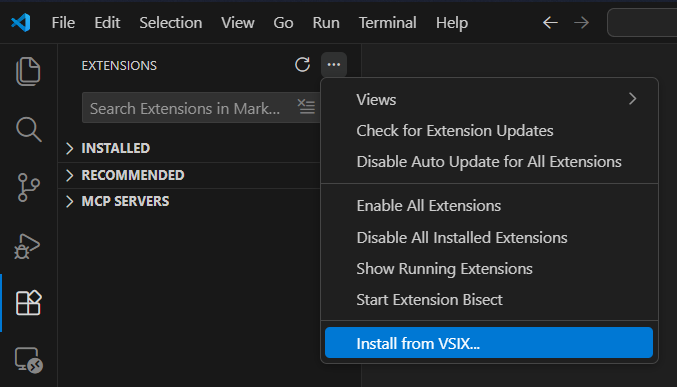

# Install Continue Extension to IDE

Choose the IDE you use and install the bundled Continue extension package from this repository.

## VS Code (VSIX)

1. Open the `extensions` folder in this repository.
2. Locate `continue.continue-1.2.14-win32-x64.vsix`.
3. In VS Code, open **Extensions**.
4. Click the **⋯** menu and choose **Install from VSIX...**.
5. Select the VSIX file and complete the install.
6. Reload VS Code if prompted.

## JetBrains IDEs (ZIP plugin)

1. Open the `extensions` folder in this repository.
2. Locate `continue-intellij-extension-1.0.59.zip`.
3. In your JetBrains IDE, go to **Settings/Preferences → Plugins**.
4. Click the gear icon and choose **Install Plugin from Disk...**.
5. Select the ZIP file and restart the IDE.

