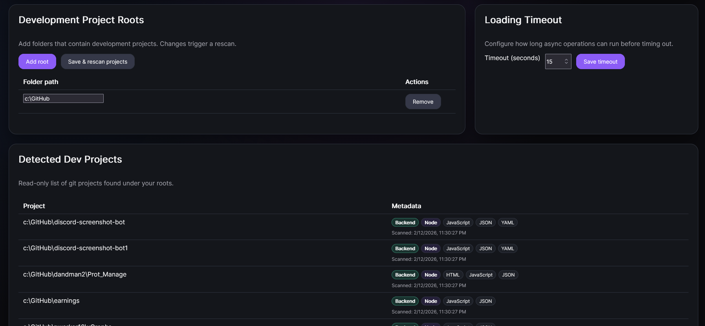

# Add Development Project Roots

Add local root folders where your git projects live so DCC Hub can detect projects and install AI assets into them.

## Steps

1. Open **Settings**.
2. In **Dev Project Roots**, click **Add Root**.
3. Choose the parent folder(s) that contain your development repositories.
4. Save your root entries.
5. Click **Scan** to discover git projects under those roots.
6. Verify discovered projects appear in the **Detected Projects** list.

## Why scanning is required

Adding roots only stores locations. Scanning is what:

- Walks those roots and finds git repositories.
- Identifies projects that can receive installed definitions.
- Makes projects available in the Hub project selector.
- Enables relevant prompt and AI asset recommendations per project context.

