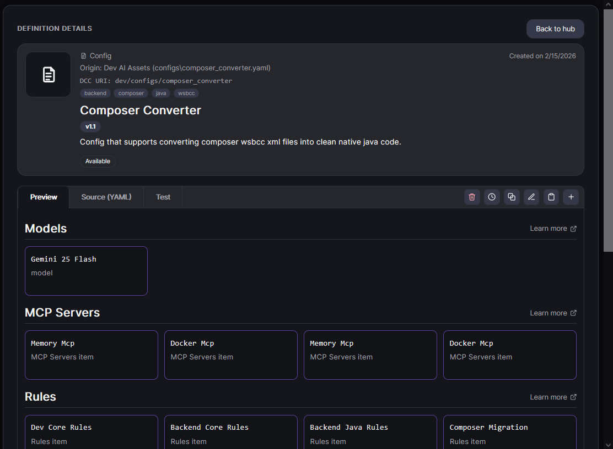

# Inspect Definition

Open a definition to review details before installing or editing.

## What to review in definition details

- **Overview:** summary, metadata, tags, and intended usage.
- **Actions:** install, edit, copy, and other available commands.
- **Source view:** inspect raw YAML and Markdown source content.
- **Test tab:** run or review test-related checks where available.

## Typical inspection flow

1. Open a definition card from the main list.
2. Review the Overview for purpose and compatibility.
3. Open source tabs to verify YAML/MD content.
4. Check the Test tab results and notes.
5. Proceed to install or edit.

