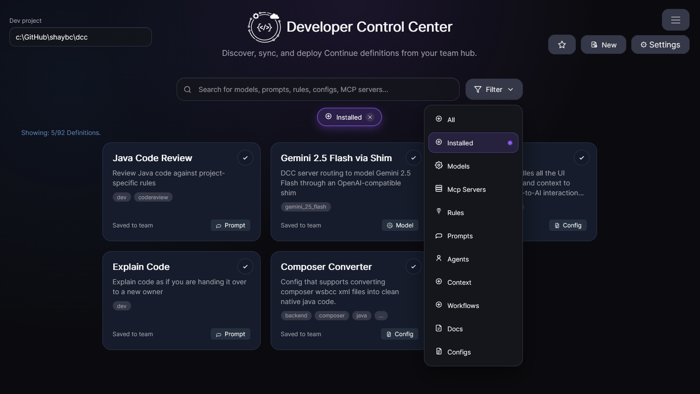

# Search & Filter Definitions

DCC Hub provides several ways to narrow down definitions quickly.

## Available options

- **Search bar:** free-text search across names, descriptions, and relevant metadata.
- **Filter menu:** select predefined filters (for example by type or state).
- **Tags:** click tags attached to definitions to pivot into related entries.
- **Menu options:** use additional search and filter controls from the main menu.

## Suggested workflow

1. Start with free-text search to narrow the list.
2. Apply filter menu options to reduce noise.
3. Use tags on a promising definition to jump to related content.
4. Refine until only relevant definitions remain.

