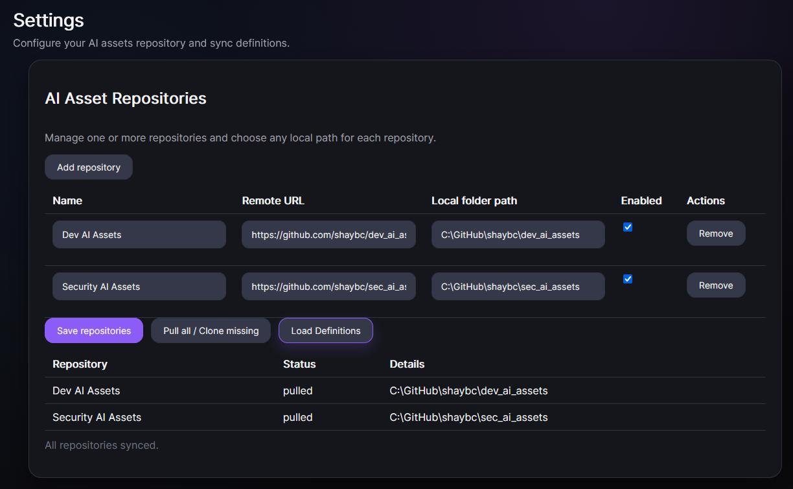

# Add AI Assets Repo

Use AI Assets repositories to keep prompts, rules, docs, workflows, and other assets maintained by the teams that own that domain expertise.

## Why add AI Assets repos?

- **Separation of concerns:** each development team can own and evolve its own AI assets.
- **Shared resources:** users can consume prompts and rules produced by other teams.
- **Scalability:** add multiple repos for different products or domains.
- **Consistency:** use centrally maintained assets instead of local one-off copies.

## Steps

1. In DCC Hub, open **Settings**.
2. In **Asset Repositories**, click **Add Repository**.
3. Fill in:
   - **Repository Name** (friendly identifier)
   - **Repository Remote URL** (git URL)
   - **Clone Folder** (local folder where the repo will be cloned)
4. Save the new repository entry.
5. Click **Pull all / Clone missing** to sync every enabled repository.
6. Click **Load Definitions** to refresh the catalog from synced repositories.
7. Confirm that definitions from the repo appear in the Hub.

## Pull all / Clone missing behavior

- If a configured local path does not exist, DCC runs clone for that repository.
- If the path exists and is already a git repository, DCC runs pull.
- The sync action runs this logic for all enabled repositories in one pass.

