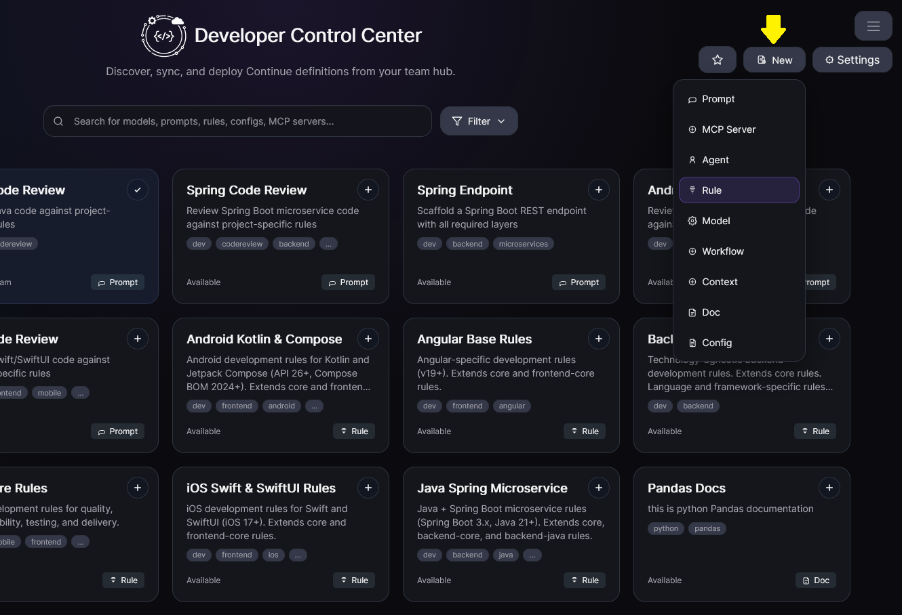
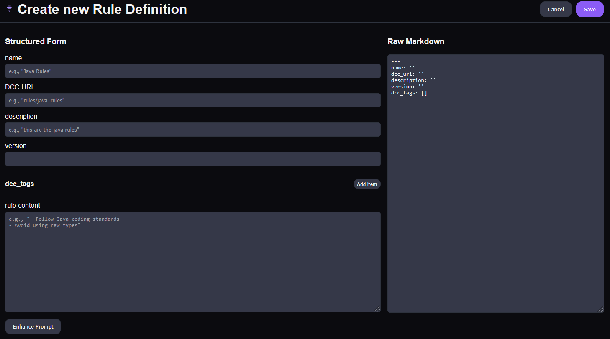

# Create New Definition

Creating a new definition follows the same editing experience used for existing definitions, but starts from a blank or templated entry.

## Steps

1. Click **Create New Definition**.
2. Select definition type and initial format.
3. Fill in required fields in the form.
4. Use autocomplete-enabled fields where available.
5. Optionally edit raw YAML/Markdown directly.
6. Save and validate the new definition.

## Notes

- The same form and raw-edit tools from **Edit Definition** are available.
- Keep metadata and tags accurate so search/filter/recommendation works well.

## Rule attributes to include when creating rule definitions

If you are creating a **rule** definition, include these fields as appropriate:

- **`globs`** (optional): file glob(s) that activate the rule when matching files are in context.
- **`regex`** (optional): regex pattern(s) that activate the rule when matching content appears in context files.
- **`alwaysApply`** (optional): whether the rule is always injected.
  - `true`: always included.
  - `false`: included only via matching `globs` or agent selection using `description`.
  - omitted: default include behavior based on `globs` presence and match.

