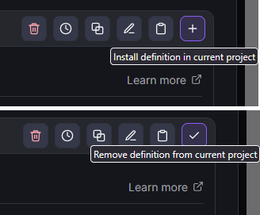
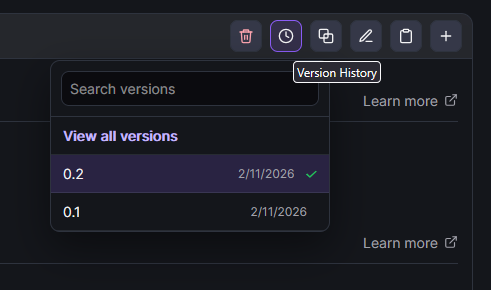
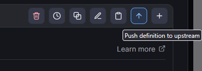

# Definition Action Buttons

These are the action buttons shown in **Definition details** near the tab bar.

## Install / uninstall definition in current project
Click **Install definition in current project** to apply the current definition to the project selected in the Hub.

- If no project is selected, the button is disabled.
- If the definition is already installed in that project (for the currently selected destination), the button changes to the uninstall state.
- For supported definition types, selecting destination is available from the install button menu.

Use this after you verify the definition is the right one and ready to be used.

## Edit definition
Click **Edit definition** to open the editor for this definition.

Use this when you need to change prompts, rules, metadata, or structure before installation.

## Duplicate definition
Click **Duplicate definition** to create a copy that you can safely modify.

During duplication, you can provide:

- a new name,
- a file name,
- a DCC URI,
- and optionally adjusted content.

Use duplication when you want a variant without changing the original definition.

## Copy definition
Click **Copy definition** to copy the full definition content to your clipboard.

Use this for quick sharing, backup snippets, or external review.

## Version history
Click **Version history** to open historical versions of the definition fetched from the Git repository.

From version history you can:

- open and inspect an older version,
- compare versions in diff mode,
- restore a historical version as a new current version (after confirmation).

Use this when debugging regressions, auditing changes, or rolling back problematic edits.

## Push definition to upstream (when available)
**Push definition to upstream** appears for untracked/local definitions that can be published upstream.

Use this when a local definition should become shared in the team repository.

## Delete definition (when available)
**Delete definition** appears only when deletion is permitted.

Use this to remove a definition from its source repository. The UI asks for confirmation before deletion.
