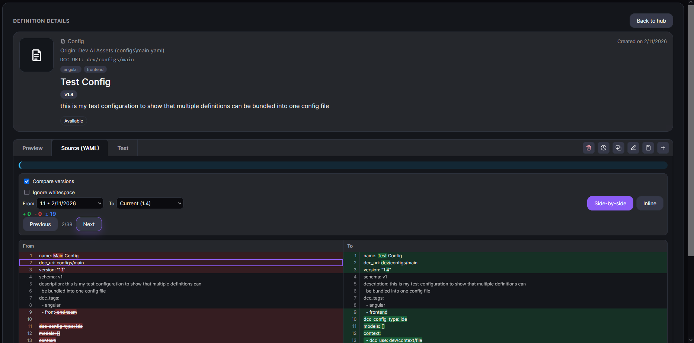

# Source and Test Tab Actions

This page covers advanced review actions available in the **Source** tab.

## Source tab: version and diff actions

When viewing Source, additional actions help you review changes deeply.

### Compare versions toggle
Enable **Compare versions** to switch from raw source view to diff comparison tools.

Use this to inspect what changed between two versions before restoring or editing.

### From / To version selectors
Choose the two versions you want to compare.

Use this to compare:

- historical → current,
- historical → historical,
- or current → current-adjacent versions.

### Ignore whitespace
Enable **Ignore whitespace** to focus only on meaningful content changes.

Use this to avoid noise from formatting-only edits.

### Diff mode: Side-by-side / Inline
Switch between:

- **Side-by-side**: easier for broad structural comparison,
- **Inline**: easier for reading one continuous stream of edits.

### Change navigation
Use **Previous** and **Next** controls to jump between detected diff hunks.

Use this to review large changes quickly without manually scrolling.

### Version banner actions (when viewing a historical version)
When you open a historical version, a banner appears with two important actions:

- **Restore this version**: previews diff and then restores that version as the latest definition after confirmation.
- **Back to current**: exits historical mode and returns to the current version.

