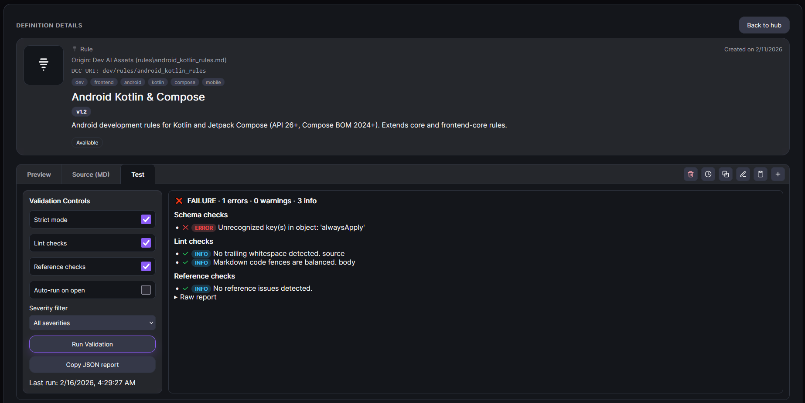

## Test tab: validation actions

The Test tab focuses on quality checks for the currently selected definition.

### How validation works
When you click **Run Validation** (or auto-run is enabled), DCC:

1. Sends the selected definition ID to the server (`POST /api/definitions/:id/validate`).
2. Loads that definition's current content from storage.
3. Validates it against server-side saved schema rules for that definition type.
4. Adds optional lint and reference checks.
5. Returns and stores a validation report that you can review and copy.

In short: the Test tab validates the definition you selected in Details, not a hard-coded example.

### Validation toggles
You can enable or disable checks before running validation:

- **Strict mode** for stricter schema validation behavior,
- **Lint checks** for style/content quality,
- **Reference checks** for cross-reference integrity,
- **Auto-run on open** to run validation automatically when opening the Test tab.

Use these controls to match the level of validation you need for your workflow.

### Auto-run on open (Auto test) explained
The **Auto-run on open** checkbox controls whether DCC triggers validation automatically when the **Test** tab becomes active.

- If enabled, opening the Test tab schedules a validation run.
- The run is delayed briefly (about 350ms) to avoid redundant calls during rapid UI changes.
- If disabled, validation runs only when you click **Run Validation**.

Use auto-run when you want immediate feedback each time you inspect a definition.

### Severity filter
Use **Severity filter** to show only errors, warnings, info, or all findings.

Use this to focus on blockers first and then follow up on lower-severity issues.

### Run Validation
Click **Run Validation** to execute checks and refresh results.

Use this after any edit or before installing/publishing a definition.

### Copy JSON report
Click **Copy JSON report** to copy the raw validation report.

Use this when you need to share exact machine-readable validation output in tickets, PRs, or chat.



## Expected schema by definition type

The following sections summarize the expected structure for each definition type used by Test tab schema checks.

### Common fields (applies to all types)

- `name` - human-readable definition name (required).
- `dcc_uri` - stable DCC identifier URI (required).
- `description` - short description of purpose (required).
- `version` - optional version string.
- `schema` - optional schema marker string.
- `dcc_tags` / `tags` - optional tags (string or list).
- `invokable` - optional boolean indicating runnability.
- `key` - optional key.
- `type` - optional type label.

### Rule (`rules`)

- `globs` - optional file glob or list of globs.
- `regex` - optional regex matcher string.
- `alwaysApply` - optional boolean to force application.

```yaml
name: JS Style Rule
dcc_uri: dcc://rules/js-style
description: Apply JavaScript style guidance
globs:
  - "**/*.js"
regex: "console\\.log"
alwaysApply: false
```

### Prompt (`prompts`)

- `prompt` - optional single prompt text.
- `messages` - optional structured chat message array.

```yaml
name: Bug Fix Prompt
dcc_uri: dcc://prompts/bug-fix
description: Prompt template for fixing bugs
prompt: |
  Analyze the issue and propose a minimal fix.
messages:
  - role: system
    content: You are a careful coding assistant.
  - role: user
    content: Fix the failing test.
```

### Workflow (`workflows`)

- `steps` - required non-empty list of workflow step objects.
- `steps[].id` - optional per-step identifier.

```yaml
name: PR Review Workflow
dcc_uri: dcc://workflows/pr-review
description: Review and prepare a pull request
steps:
  - id: gather-context
  - id: run-validation
```

### Agent (`agents`)

- Uses common fields only in schema checks.

```yaml
name: Senior Engineer Agent
dcc_uri: dcc://agents/senior-engineer
description: Agent persona for implementation and review
invokable: true
```

### Model (`models`)

- `provider` - optional model provider name.
- `model` - optional model identifier.

```yaml
name: GPT-5.2 Codex
dcc_uri: dcc://models/gpt-5-2-codex
description: Primary coding model
provider: openai
model: gpt-5.2-codex
```

### Context (`context`)

- `provider` - optional context provider identifier.

```yaml
name: Repo Context
dcc_uri: dcc://context/repo
description: Repository-aware context provider
provider: local-repo
```

### MCP Server (`mcpservers`)

- `transport` - optional transport type.
- `tools` - optional list of exposed tools.

```yaml
name: Browser MCP
dcc_uri: dcc://mcpservers/browser
description: Browser automation MCP server
transport: stdio
tools:
  - name: navigate
  - name: screenshot
```

### Config (`configs`)

- `dcc_config_type` - required enum: `agents` or `ide`.
- `dcc.config_type` - optional enum: `agents` or `ide`.
- `models[]` / `context[]` / `rules[]` / `prompts[]` / `docs[]` / `mcpServers[]` - optional arrays where each item contains:
  - `dcc_use` - required string reference.

```yaml
name: Team IDE Config
dcc_uri: dcc://configs/team-ide
description: IDE config for team setup
dcc_config_type: ide
dcc:
  config_type: ide
models:
  - dcc_use: models/gpt-5-2-codex
rules:
  - dcc_use: rules/js-style
prompts:
  - dcc_use: prompts/bug-fix
docs:
  - dcc_use: docs/platform-docs
mcpServers:
  - dcc_use: mcpservers/browser
```

### Docs (`docs`)

- `docs` - required non-empty list of doc source objects.
- `docs[].name` - required display name.
- `docs[].startUrl` - required valid URL.
- `docs[].favicon` - optional valid URL.

```yaml
name: Platform Docs
dcc_uri: dcc://docs/platform
description: External documentation sources
docs:
  - name: API Reference
    startUrl: https://example.com/docs/api
    favicon: https://example.com/favicon.ico
```
