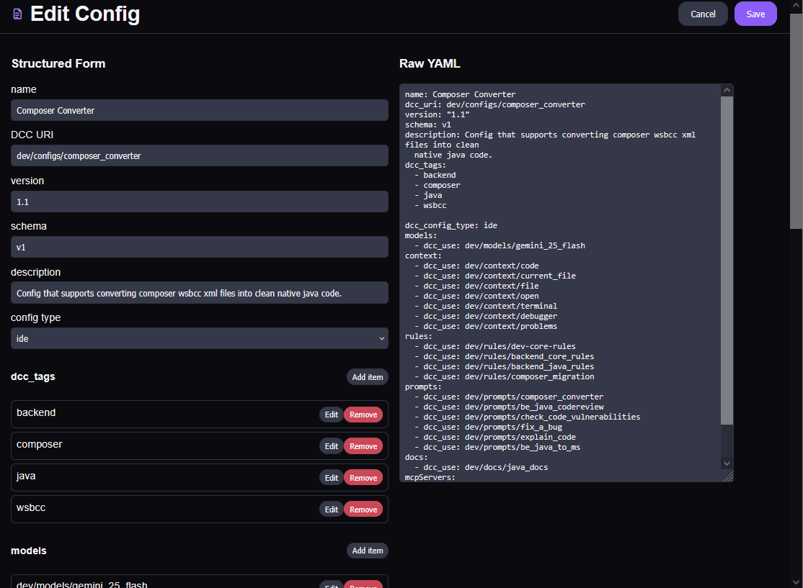

# Edit Definition

Use the editor to modify existing definitions safely and quickly.

## Editing capabilities

- **Structured form editing** for common fields.
- **Autocomplete** support in specific fields to improve speed and consistency.
- **Raw YAML / Markdown editing** for advanced control.
- Ability to switch between form and raw editing paths as needed.

## Typical edit flow

1. Open a definition and click **Edit**.
2. Update fields in the form (using autocomplete where offered).
3. Optionally switch to raw YAML/MD for direct source edits.
4. Save and validate the updated definition.

## Editing agent definitions

For **Agent** definitions, the editor keeps frontmatter fields (`name`, `description`, optional `model`, `rules`, `mcpServers`) in the form and the system prompt in the Markdown body.

