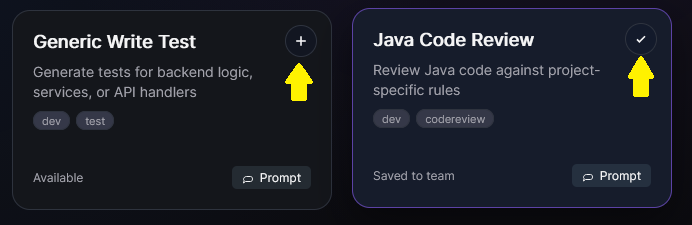
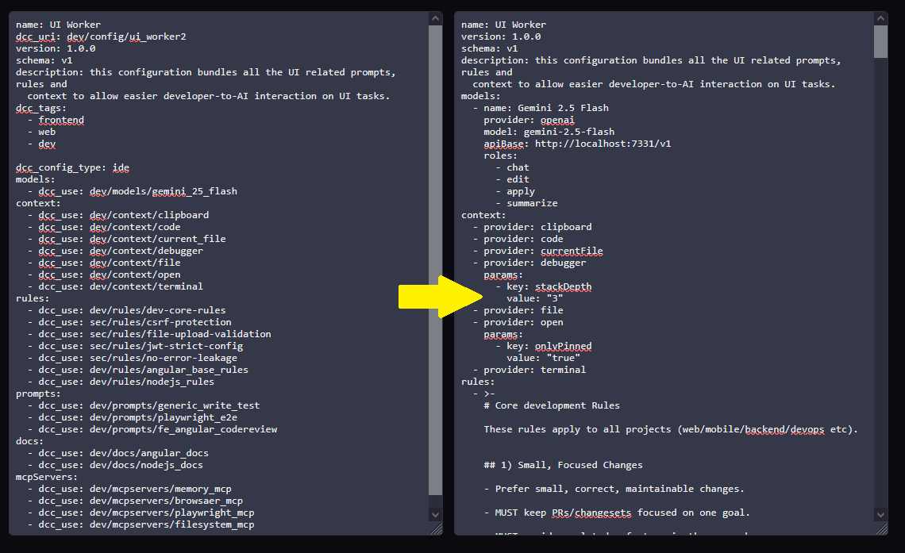

# Install Definition into Project

Install selected definitions into the currently selected development project.

This action supports two install modes:

- **Continue install** (default), which installs into Continue-managed project files.
- **Destination export** for **GitHub Copilot** or **Gemini CLI**.

## Select the current project first

1. In the Hub header, choose a project from the **Dev project** selector.
2. Make sure you are on the project where you want definitions installed.

When you switch projects, installation markers update so you can see what is already installed per project.

## Install action

1. Open a definition details view.
2. (Optional) Choose a destination from the **Destination** selector:
   - **Continue** (default)
   - **GitHub Copilot**
   - **Gemini CLI**
2. Click the **+** button (**Install definition in current project**).
3. DCC Hub installs the definition into the selected project.

## Installed state and filtering options

- Installed definitions are visibly marked for the current project.
- Use the **Installed** filter to show only installed definitions.
- Use **Hide Installed Definitions** from the menu to focus only on definitions not yet installed.

## Merge behavior during install

For complex definitions (such as configuration-based definitions), installation can include merge logic:

- Existing project configuration is read.
- New definition content is merged into compatible sections.
- Existing values are preserved where possible.
- Resulting config is written back in install target files.

This helps apply shared definitions without fully replacing project-specific customization.

## Copilot/Gemini export behavior (v1)

When destination is set to **GitHub Copilot** or **Gemini CLI**, v1 currently exports:

- `rules`
- `prompts`

### Output locations

- **Copilot**
  - Rules: `.github/copilot-instructions.md`
  - Prompts: `.github/prompts/<dcc-uri-slug>.prompt.md`
- **Gemini CLI**
  - Rules: `.gemini/instructions.md`
  - Prompts: `.gemini/commands/<dcc-uri-slug>.md`

### Skipped types and why

Types other than `rules` and `prompts` are skipped in v1 for these destinations.
Reason: those types do not yet have stable destination-specific conversions, so DCC avoids partial or lossy exports.

### Idempotent updates

- Re-exporting a rule updates/replaces only the matching DCC-managed block in the destination instructions file.
- Re-exporting a prompt overwrites the same generated prompt file path.

This keeps export safe to run repeatedly during normal iteration.

For a focused walkthrough, see **Export to Copilot and Gemini**.

to learn more on each AI system go to:
[Continue.dev](https://docs.continue.dev/customize/overview)
[Github Copilot](https://docs.github.com/en/copilot/how-tos/configure-custom-instructions/add-repository-instructions?tool=vscode)
[Gemini CLI](https://geminicli.com/docs/cli/custom-commands/)
