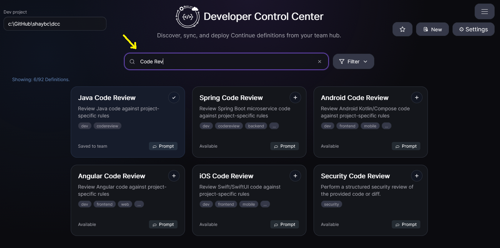
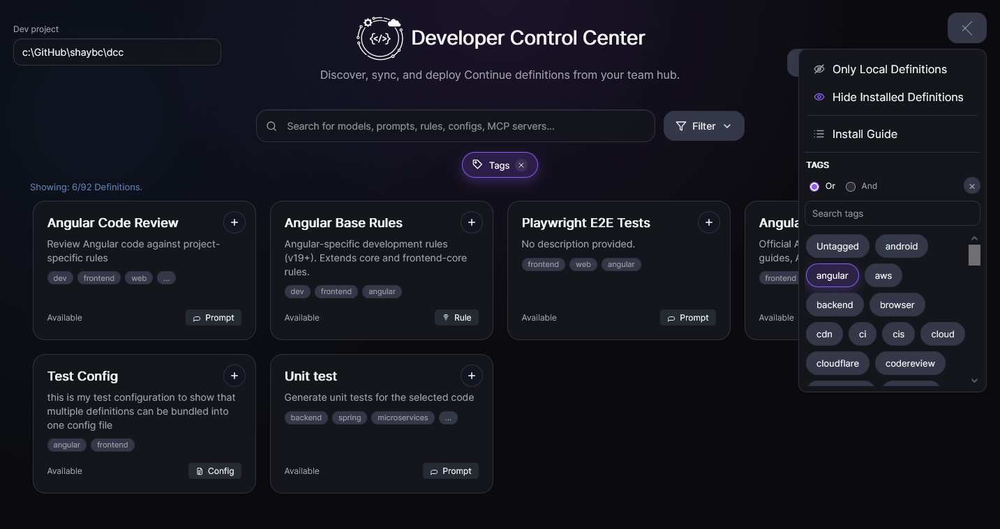

# Search & Filter Definitions

DCC Hub provides several ways to narrow down definitions quickly.

## Available options

- **Search bar:** free-text search across names, descriptions, and relevant metadata.
- **Semantic intent search (AI):** if normal search returns zero cards, DCC offers an AI fallback that can rank relevant definitions based on your goal-oriented query.
- **Filter menu:** select predefined filters (for example by type or state).
- **Tags:** click tags attached to definitions to pivot into related entries.
- **Menu options:** use additional search and filter controls from the main menu.

## Semantic intent search fallback

When your search text has no direct matches, the cards area shows:

- **"Would you like the AI to search ?"**
- **"Search with AI"** button

Click **Search with AI** to send your current search text together with definition names/descriptions to the AI ranking endpoint. The returned ranked suggestions are then displayed like normal search results.

Behavior details:

- Semantic results persist while the search text stays the same.
- You can paginate semantic results and open definition details normally.
- Semantic results reset automatically when the search text changes.

## Suggested workflow

1. Start with free-text search to narrow the list.
2. If no direct matches appear, use **Search with AI** for intent-based ranking.
3. Apply filter menu options to reduce noise.
4. Use tags on a promising definition to jump to related content.
5. Refine until only relevant definitions remain.

