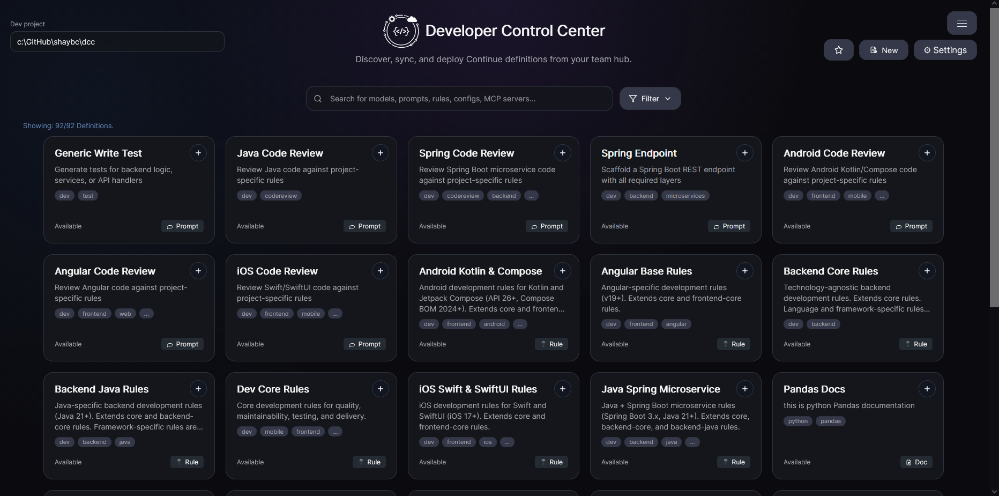

# What is Continue.dev and DCC

**Continue.dev** is an AI coding assistant platform that brings chat, edit, and automation workflows directly into your IDE so teams can use AI in day-to-day development.

**DCC (Definition Control Center)** is this management system for organizing Continue definitions in one place so they can be discovered, reviewed, validated, versioned, and installed into real projects.

## Definition types in DCC

Below are the definition types supported by this DCC system:

- **Prompt:** a reusable instruction (single prompt or message set) for specific AI tasks.
- **Rule:** a guideline that shapes model behavior and output style across interactions.
- **Workflow:** a multi-step process that chains prompts and tools into a repeatable execution path.
- **Model:** a model/provider definition that identifies which LLM configuration should be used.
- **Agent:** a composed assistant profile that references rules, prompts, context, and models.
- **MCP Server:** a tool/server integration definition used to connect external capabilities.
- **Context:** shared background information that can be injected to improve relevance.
- **Doc:** documentation content packaged as an asset for retrieval, guidance, or grounding.
- **Config:** a bundle/composition definition that references multiple assets for project use.

## DCC overview and purpose

DCC exists to help teams treat AI assets like software assets: organized, searchable, testable, and version-controlled.

Its core purpose is to provide a single workflow for:

- discovering and filtering available definitions,
- inspecting details, source, and validation/test results,
- creating and editing definitions with type-aware forms,
- installing selected definitions into development projects,
- and managing lifecycle tasks such as duplication, publish, and history restore.

In short, DCC helps teams scale Continue usage safely and consistently by centralizing governance and day-to-day operations for AI definitions.
